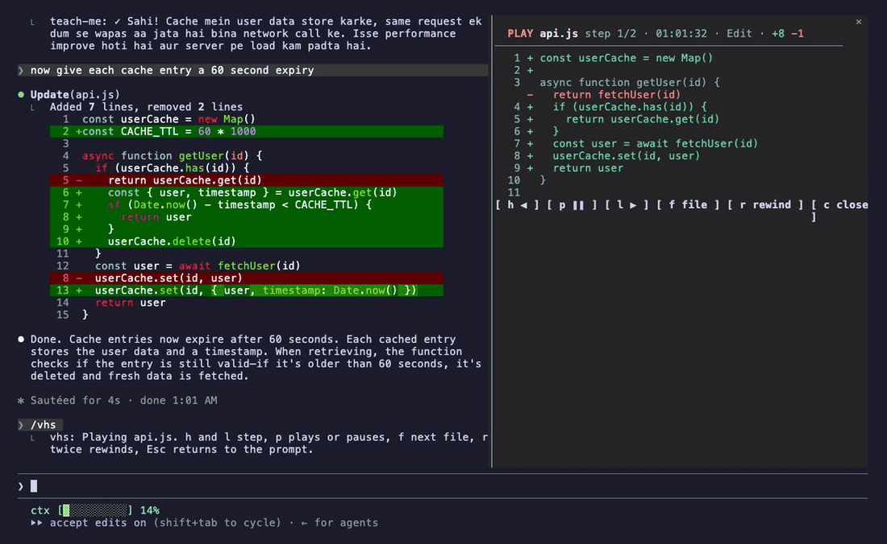

# vhs

**A tape of every edit Claude makes.** A [Claude Code](https://code.claude.com) mod.



A real, unedited session: after Claude edits `api.js` twice, `/vhs` opens the tape.

Every Edit and Write is snapshotted before and after, so each file has its versions in order. `/vhs` opens a pane that replays them: the diff is computed line by line (unchanged lines stay context, as in git) and the new lines type themselves in.

Like git history for one session, without committing every keystroke.

## Keys and commands

- `h` / `l` step, `p` play or pause, `f` next file, `c` close
- `r` **twice** rewinds the file to the step on screen (one press only arms it; the rewind is taped too)
- `/vhs`, `/vhs list`, `/vhs <file>`, `/vhs close`

## What it touches

The files Claude edits: read before and after each edit, and written only when you press `r` twice. The tape lives in memory for the session.

## Install

Claude Code **2.1.287 or newer** runs mods out of the box. On 2.1.273 to 2.1.286, start it with `CLAUDE_CODE_ENABLE_FUNCTION_HOOKS=1` first.

```bash
claude plugin marketplace add saksham10arora-dotcom/claude-vhs
claude plugin install vhs@nerfsaksham-vhs
```

Every option has a default, so the installer's "userConfig options not yet set" note is safe to ignore.

Or try it without installing:

```bash
git clone https://github.com/saksham10arora-dotcom/claude-vhs && claude --plugin-dir claude-vhs
```

## Develop

```bash
claude plugin validate .
claude plugin test .
```

## More mods

Part of a set: [teach-me](https://github.com/saksham10arora-dotcom/claude-teach-me) · [vhs](https://github.com/saksham10arora-dotcom/claude-vhs) · [frugal](https://github.com/saksham10arora-dotcom/claude-frugal) · [lofi](https://github.com/saksham10arora-dotcom/claude-lofi). More community mods: [awesome-claude-mods](https://github.com/saksham10arora-dotcom/awesome-claude-mods).

MIT. Made by [Saksham Arora](https://saksham.digital) ([@nerfsaksham](https://x.com/nerfsaksham)).
